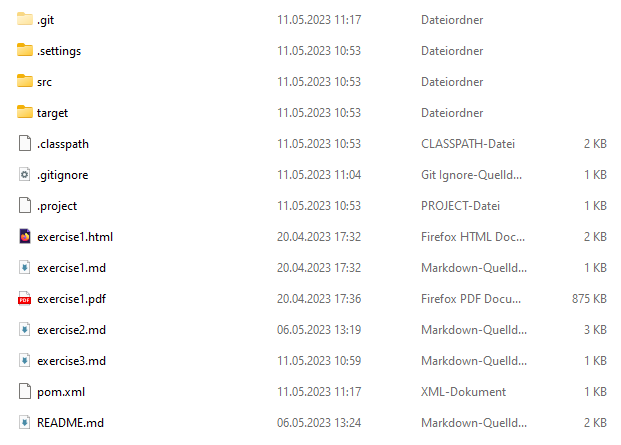
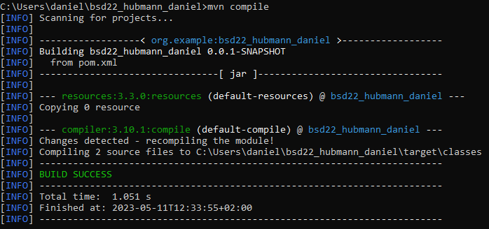

# Exercise 3: Maven Projektstruktur

## Dokumentation der Arbeitsschritte

- Installation von JDK und Maven
- Setzen der Umgebungsvariablen JAVA_HOME (ohne .../bin) und PATH (mit .../bin)
- Erstellen eines neuen Maven Projekts in Eclipse
- Erstellen der Calculator- und Main-Klassen
- Ausführen des Codes (target-Folder wird erstellt - siehe Screenshot)

- properties-Block der pom.xml zufügen
- Ausführen des Codes
- Projekt builden mit "mvn compile" (siehe Screenshot)

